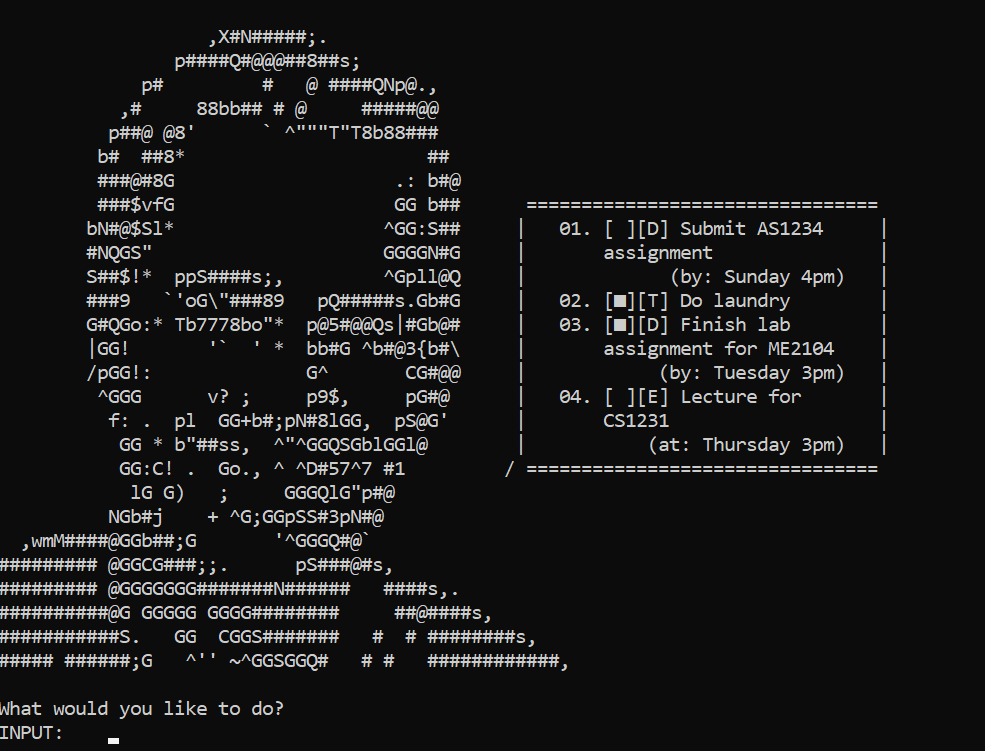
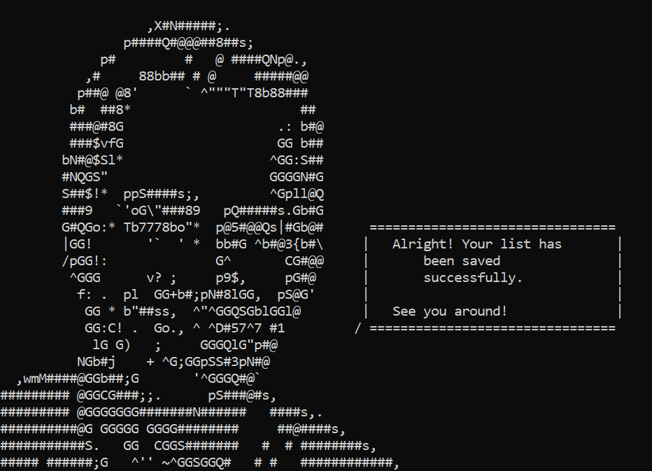
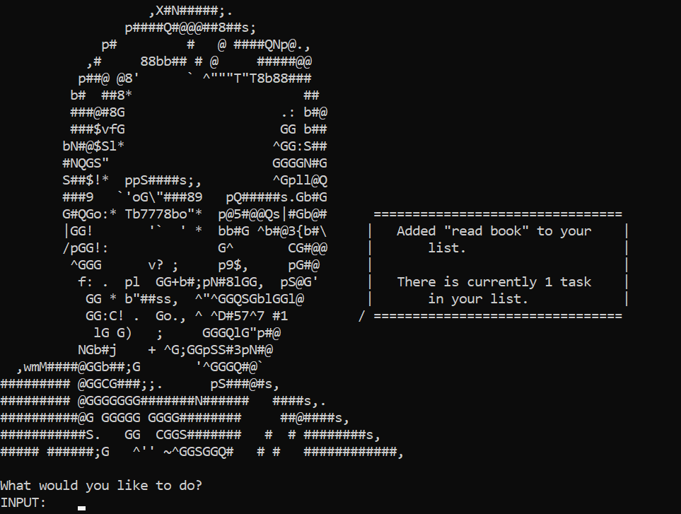
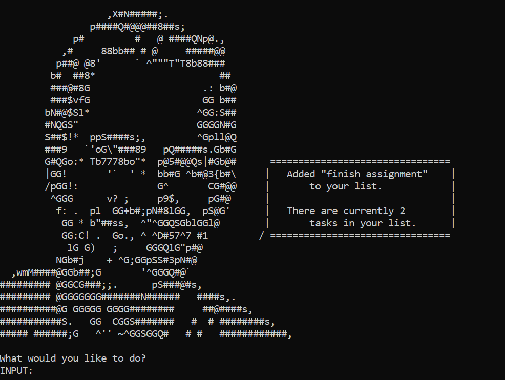
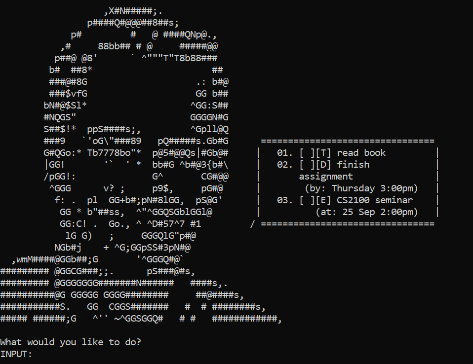
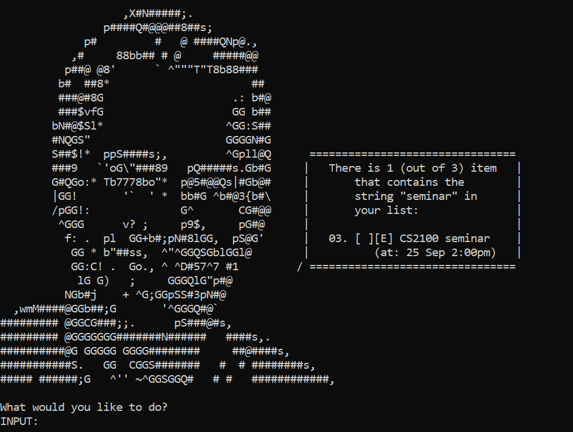
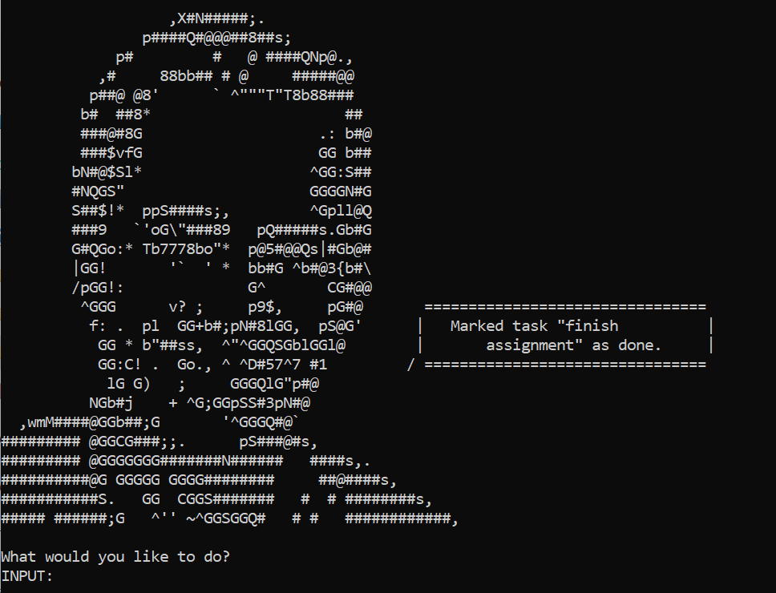
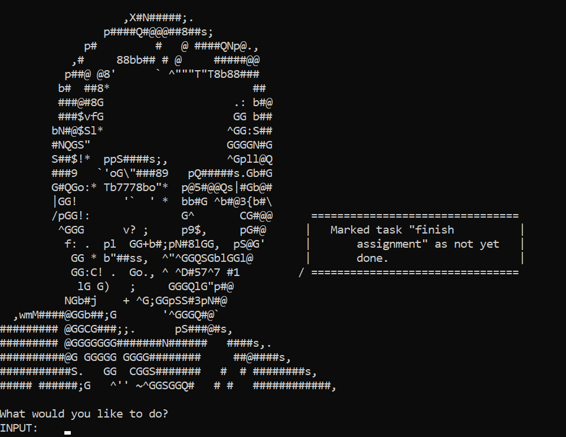

# User Guide

## Features 

Duke is a Personal Assistant Chatbot that can help you keep track of various 
tasks, events and deadlines.

### Add and keep track of different types of tasks
The task manager that is core to Duke's functionality allows the 
creation, deletion and marking/unmarking of tasks as done. These tasks can then be viewed at a glance, formatted for your viewing pleasure.

Duke supports the tracking of three different types of tasks:

#### To-do Tasks
To-do tasks are the standard types of tasks with no additional information. 

#### Deadline Tasks
Deadline tasks holds an additional point of data: when the task should be completed by. This task is useful for tracking things that may have to be completed by a certain time (deadlines, submissions, homework).

#### Event Tasks
Event tasks include information about when a task will happen, useful for tracking things that happen on a certain time and date (for example, lectures, birthdays, seminars).

### Automatic loading and saving of task list
Your list of tasks will be saved with every modification (marking/unmarking as done, adding or deleting), as well as on exit of the program. This save file is in a format easy for you to modify in a text editor if you so choose.

This task list will also be loaded when the program is opened.

### Viewing and searching tasks

Your tasks can be presented to you in a formatted list, allowing you to view your tasks at a glance.

You can also search for tasks that contain a certain string of text as a formatted list of all task items matching the search criteria.

# Usage

## Starting and Exiting Duke

### Program initialisation

Duke can be initialized by navigating the command line to the directory containing `Duke.jar` and entering:

`java -jar Duke.jar`

**Note: Upon program startup, Duke will create a `save` subdirectory in your chosen directory. This folder will contain the save file for Duke, called `duke.txt`. This file can be edited if you wish to, but will be overwritten if the file is found to be of invalid format.** 

### `bye` - Program Exit

This saves all current items in your task list and exits the program.

The current list will be saved to the save file `duke.txt` in the subdirectory `save` after this command is run.

#### Example input:

`bye`

#### Expected output:

Program exits.

## Adding Tasks

### `todo` - Add To-do Task

Adds a to-do task item to the task list. This type of task contains no date/time information, only allowing marking and unmarking.

The list will be saved to the save file `duke.txt` in the subdirectory `save` after this command is run.

#### Example input: 

`todo read book`

#### Expected output:

The to-do task should be added to your list.

### `deadline` - Add Deadline Task

Adds a deadline task item to the task list. This type of task contains information about when a task should be completed by, and supports marking/unmarking as done.

The subcommand `/by`, and an argument after is required for the deadline task to be added. The argument after `/by` will be stored as the time when the task should be completed by.

The current list will be saved to the save file `duke.txt` in the subdirectory `save` after this command is run.

#### Example input:

`deadline finish assignment /by Thursday 3:00pm`

#### Expected output:

The deadline task should be added to your list.

### `event` - Add Event Task

Adds an event task item to the task list. This type of task contains information about when a task will happen and supports marking/unmarking as done.

The subcommand `/at`, and an argument after is required for the event task to be added. The argument after `/at` will be stored as the time the event will happen.

The current list will be saved to the save file `duke.txt` in the subdirectory `save` after this command is run.

#### Example input:

`event CS2100 seminar /at 25 Sep 2:00pm`

#### Expected output:

The event task should be added to your list.

## Task Display

### `list` - List All Tasks

Generates a formatted list of all the tasks and displays it.

#### Example input:

`list`

#### Expected output:

A list of all tasks.

### `find` - Find Task

Performs a search for any tasks that contain the substring given after the command.

An argument is required after the `find` command as the substring that should be searched for.

#### Example input:

`find seminar`

#### Expected output:

List of all the tasks that contain the given substring. The number of items found (out of the total items in the list) will also be displayed.

## Task Modification

### `mark` - Mark Task As Done

Marks a task as complete. In the `list` display, a square icon (■) will be displayed to show that the task is marked.

A number corresponding to the task number is required after the `mark` command. This number can be seen next to the tasks in `list` view.

A task that is already marked will not have any change to its state.

The current list will be saved to the save file `duke.txt` in the subdirectory `save` after this command is run.

#### Example input:

`mark 2`

#### Expected output:

The task corresponding to the task number will be marked as done.

### `unmark` - Mark Task As Not Done

Marks a task as not complete. In the `list` display, the square icon (■) will be removed to show that the task is marked as not done.

A number corresponding to the task number is required after the `unmark` command. This number can be seen next to the tasks in `list` view.

A task that is already not marked will not have any change to its state.

The current list will be saved to the save file `duke.txt` in the subdirectory `save` after this command is run.

#### Example input:

`unmark 2`

#### Expected output:

The task corresponding to the task number will be marked as done.

### `delete` - Describe action

Deletes task from list. 

**Note: This operation will affect the numbering of all tasks that come after it.**

The current list will be saved to the save file `duke.txt` in the subdirectory `save` after this command is run.

#### Example input:

`delete 3`

#### Expected output:

Task is deleted from list.

